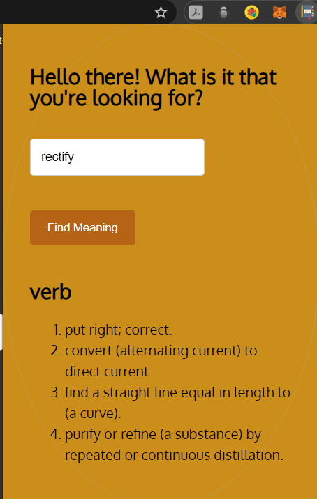

# English dictionary extension

## Description

-> This is a browser extension developed using the following free API:
https://dictionaryapi.dev/

### Directions of use:

1. chrome://extensions/
2. Switch on the developer mode through an option given on top right corner.
3. Now, we can add extensions created by our own selves.
4. Click on "Load Unpacked" on top left corner below the top bar.
5. Choose the complete extension folder and click "Select Folder".

#### Technologies

-> Javascript

##### Screenshot

> 
